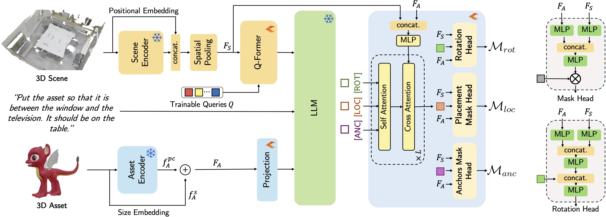
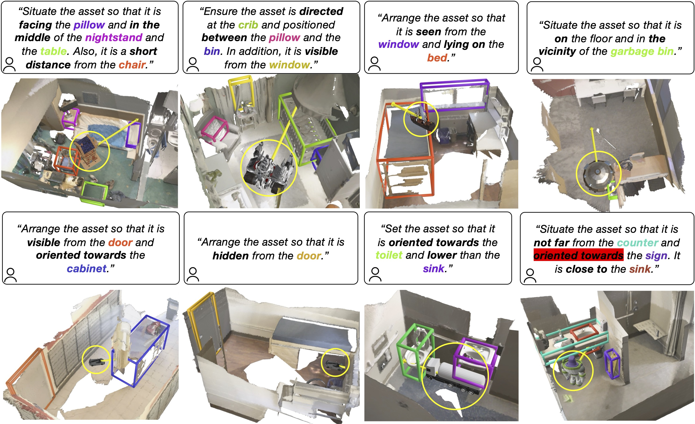

# PlaceIt3D: Language-Guided Object Placement in Real 3D Scenes [ICCV 2025]

<div align="center">

[**Ahmed Abdelreheem**](https://samir55.github.io)²*, [**Filippo Aleotti**](https://filippoaleotti.github.io/website/)¹, [**Jamie Watson**](https://scholar.google.com/citations?user=5pC7fw8AAAAJ)¹, [**Zawar Qureshi**](https://scholar.google.com/citations?user=P2jZC8YAAAAJ)¹, [**Abdelrahman Eldesokey**](https://abdo-eldesokey.github.io/)², [**Peter Wonka**](https://peterwonka.net/)², [**Gabriel Brostow**](http://www0.cs.ucl.ac.uk/staff/G.Brostow/)¹³, [**Sara Vicente**](https://scholar.google.com/citations?user=7wWsNNcAAAAJ)¹, [**Guillermo Garcia-Hernando**](https://guiggh.github.io/)¹

¹Niantic Spatial, ²KAUST ³UCL

[](https://nianticlabs.github.io/placeit3d/)
[](http://arxiv.org/abs/2505.05288)

</div>

## 📋 Overview


We introduce PlaceIt3D, a novel task and benchmark for language-guided object placement in real 3D scenes. Given a 3D scene point cloud, a 3D asset, and a natural language prompt, the goal is to predict a valid placement that respects semantic and geometric constraints, including object relationships, free-space reasoning, and occlusions. We propose a new evaluation protocol, a dataset for training 3D LLMs on this task, and a baseline method that predicts placement location, anchor localization, and valid rotations.

## 🔬 Method



## 🚀 Installation

### ⚙️ System Requirements

Our code is tested on the following setup:
- CUDA 11.8
- PyTorch 2.0.0
- transformers 4.33.2
- [NVIDIA Container Runtime version 1.17.8](https://docs.nvidia.com/datacenter/cloud-native/container-toolkit/latest/install-guide.html) (needed for running the PlaceIt3D-Benchmark, see instructions below)

### 🐍 Step 1: Create Conda Environment

```bash
conda create -n placeit3d python=3.9 pip=25.0 -y
conda activate placeit3d
```

### Step 2: Install PyTorch and Dependencies

```bash
pip install torch==2.0.0 torchvision==0.15.1 torchaudio==2.0.1 --index-url https://download.pytorch.org/whl/cu118 
pip install spconv-cu118
```

```bash
conda install ninja google-sparsehash -c bioconda
```

```bash
pip install trimesh==4.0.1 loguru torch-scatter ipdb timm gorilla-core transformers==4.33.2 peft==0.9.0 
pip install -U "ray[default]"
```

### Step 3: Install LAVIS

```bash
git clone https://github.com/salesforce/LAVIS.git SalesForce-LAVIS
cd SalesForce-LAVIS
# Ignore open3D as the pinned version in requirements.txt causes problems later and it is not needed in our codebase.
pip install -r <(grep -v "open3d" requirements.txt) numpy==1.26
```

### Step 4: Clone PlaceIt3D repo
```bash
git clone https://github.com/nianticlabs/placeit3d.git
```

### Step 5: Install PointGroup Operations

```bash
cd lavis/models/placewizard_model/lib
python setup.py develop
```

## 📁 Data Preparation

### Expected Data Structure

The final structure of the `data` folder should be as follows:

```bash
data/
    PlaceIt3D/
              placeit3d_train.h5 
              placeit3d_val.h5 
              placeit3d_test.h5 
    scannetv2/
              train/
              val/
    superpoints/
              *.npy
    pointbert_embeddings/
              *.pt
```

### Step 1: ScanNet Scans

To prepare ScanNet, please follow the data preparation instructions found in the [Reason3D repository](https://github.com/KuanchihHuang/Reason3D?tab=readme-ov-file#data-preparation).

### Step 2: PlaceIt3D Dataset & Benchmark

Download the train/val/test sets from [here](https://drive.google.com/drive/folders/1A-_FI9TrrFPetmj1BSlydrALkt6kT5fD?usp=sharing).

### Step 3: Uniform Spatial Superpoints

Download the superpoints from [here](https://drive.google.com/file/d/1m-9G8OoORjDqd4_OSR5ds3Xnj9WlEDdN/view?usp=sharing) and extract the zip file inside the `data` folder. Ensure you maintain the same folder structure for the `data` folder as mentioned above.

### Step 4: Download Asset PointBert Embeddings

Download the precomputed PointBert embeddings from [here](https://drive.google.com/file/d/1np25zSZTAla_z1pJI6TDkfTykV-GihF1/view?usp=sharing). Move the downloaded file to the `data` folder, then run the following:

```bash
cd data
unzip pointbert_PartObjaverseTiny_embeddings.zip 
mv pointbert_PartObjaverseTiny_embeddings pointbert_embeddings
```

### Step 5: 3D Assets (needed for visualization purposes)

Download our resized and orientation-aligned GLBs from the TinyObjaverse-Part dataset using [this link](https://drive.google.com/drive/folders/1NsNG3mvdiWmiLB_wlitYjd50U6lfnfMZ?usp=sharing).

## Training Preparation

### Download Pretrained Scene Encoder

The final structure of the `checkpoints` folder should be as follows:

```bash
checkpoints/spformer_encoder_uniform_superpoints.pth
```

Download the pretrained scene encoder from [here](https://drive.google.com/drive/folders/1h8a_vp7rwhUX34e3xeOcTsKlGYO1k6JQ?usp=sharing) and place it in the `checkpoints` directory.

## 🏋️ Training

To train PlaceWizard on the PlaceIt3D dataset from scratch, use the following command. We train for 50 epochs:

```bash
export REPO_DIR="$(pwd)"
TOKENIZERS_PARALLELISM=false python train_ray.py --cfg-path configs/placewizard.yaml
```

Feel free to change the number of gpus parameter `ray_num_gpus` in `configs/placewizard.yaml` (but you have to adjust accordingly the batch size and the learning rate as in [this issue](https://github.com/KuanchihHuang/Reason3D/issues/14)). 

**Our pretrained checkpoint** can be downloaded from [here](https://drive.google.com/drive/folders/1z6Z6BQLUrlmzpsgO3qqrQtqqTX3xLwsn?usp=sharing).

## 📊 Evaluation

### Step 1: Generate Predictions

First, generate the predicted masks for each validation or test example. The predictions will be saved as `{val/test}_predictions.h5` and the save path will be printed after the evaluation ends.

```bash
TOKENIZERS_PARALLELISM=false python evaluate.py --cfg-path configs/placewizard.yaml --options model.pretrained={CHECKPOINT_PATH} --h5_data .h5
```

**Note:** This repository currently only supports batch size = 1 for inference.

### Step 2: Extract Translation Vectors and Rotation Angles

Extract the predicted translation vectors and rotation angles using the following command:

```bash
python eval_pred_to_json.py \
  --pred_path path_to_{val/test}_predictions.h5 \
  --superpoint_path ./data/superpoints \
  --pcd_path ./data/scannetv2/val \
  --mesh_path SCANNET_PATH/scans/ \
  --test_h5 ./data/PlaceIt3D/placeit3d_{val/test}.h5
```

### 🐳 Step 3: Run Rule-Based Evaluation

Once the predictions are ready, run the rule-based evaluation executable.

First, pull the Docker image:

```bash
docker pull aabdelreheem/placeit3d-benchmark:latest
```

Then run the evaluation on the test set:

```bash
docker run --gpus all \
  -v "path_to_scannet/scans:/app/mounted_scannet/scans:ro" \
  -v "path_to_prediction/predictions.json:/app/test_input/predictions.json:ro" \
  -v "path_to_save_output/:/app/test_output" \
  aabdelreheem/placeit3d-benchmark:latest test
```

The benchmark metrics performance will be printed after running the above code and saved in a `.json` file.

Similarly, to run the benchmark on the validation set, run the following command:

```bash
docker run --gpus all \
  -v "path_to_scannet/scans:/app/mounted_scannet/scans:ro" \
  -v "path_to_prediction/predictions.json:/app/val_input/predictions.json:ro" \
  -v "path_to_save_output/:/app/val_output" \
  aabdelreheem/placeit3d-benchmark:latest val
```


## 🖼️ Qualitative Examples



## 🙏 Acknowledgments

Our code is mainly based on [Reason3D](https://github.com/salesforce/LAVIS), [ReferIt3D](https://referit3d.github.io/), [VLA-3D](https://github.com/HaochenZ11/VLA-3D), [Cap3D](), [Shap-e](), [3D-LLM](https://github.com/UMass-Foundation-Model/3D-LLM), and [3D-STMN](https://github.com/sosppxo/3D-STMN). Thanks to the authors for their amazing contributions!


## 📝 Citation

If you find our work useful for your project, please consider citing our paper:

```bibtex
@inproceedings{abdelreheem2025Placeit3d,
  author = {Abdelreheem, Ahmed and Aleotti, Filippo and Watson, Jamie and Qureshi, Zawar and Eldesokey, Abdelrahman and Wonka, Peter and Brostow, Gabriel and Vicente, Sara and Garcia-Hernando, Guillermo},
  title = {PlaceIt3D: Language-Guided Object Placement in Real 3D Scenes},
  booktitle = {ICCV},
  year = {2025}
}
```

Copyright © Niantic Spatial 2025. Patent Pending. All rights reserved.
