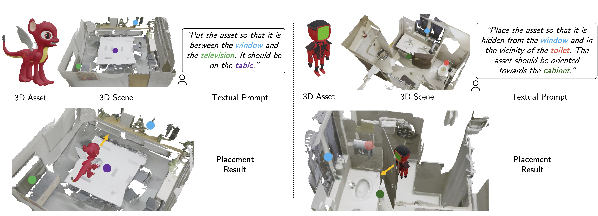

# PlaceIt3D: Language-Guided Object Placement in Real 3D Scenes
<p align="center">
  
</p>
<b>Dataset, benchmark and code coming soon!</b>

- [Project page](https://nianticlabs.github.io/placeit3d/)
- [arXiv link](https://arxiv.org)
- BibTeX:
```
@article{abdelreheem2025Placeit3d,
        author = {Abdelreheem, Ahmed and Aleotti, Filippo and Watson, Jamie and Qureshi, Zawar and Eldesokey, Abdelrahman and Wonka, Peter and Brostow, Gabriel and Vicente, Sara and Garcia-Hernando, Guillermo}
        title = {PlaceIt3D: Language-Guided Object Placement in Real 3D Scenes},
        journal = {arXiv},
        year={2025}
}
```
Copyright © Niantic Spatial 2025. Patent Pending.
All rights reserved.